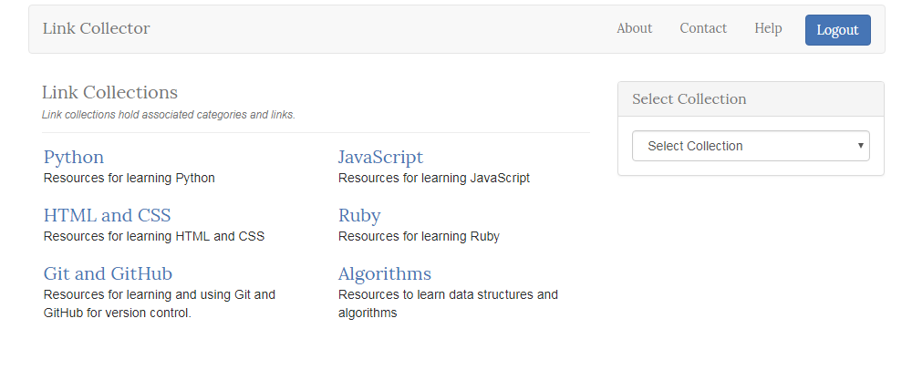

# Link Collector

Link Collector is a multi-user bookmarking web app built with Flask, a Python Microframework where users can login with their Google account. Admin users can create categories and collections, and non-admin users can add links and update or delete their own links. Admins can edit or delete any links.

In the app, links are contained in categories, and categories are all part of a more general collection. For instance, you might have a collection called <em>Recipes</em>, and within that collection you have categories like <em>Breakfast</em>, <em>Entrees</em>, and <em>Desserts</em>. You would then add links to breakfast recipes in the <em>Breakfast</em> category, and links to desserts in the <em>Desserts</em> category, etc.

## Demo

Check out the demo at https://links.pythonanywhere.com



## Run the Project in a Local Development Environment

These instructions assume you have Python 2.7 installed and that Python 2 is the version of Python running the files. There may be errors if Python 3 is used as this app has not been updated to use Python 3 yet.

* Clone, fork, or download this repository.
* Rename the file `secret.py.config`to `secret.py`.
* Edit `secret.py` and enter your own secret key of randomly generated characters as the value for the variable `SECRET_KEY`. _Note: `secret.py` is in the `.gitignore` - take care to ensure it's named properly and that it doesn't get committed to an online repository._


### Database Setup

* Install [PostgreSQL](https://www.postgresql.org/) if not already installed.
* Create a PostgreSQL user ID to use for app. 
  * To quickly test it out locally, you could create a Postgres superuser role. On Windows, you can create a username with the same name as your login to get it to work easily for development purposes only. See below for how to do this from the psql command prompt which you'd get by entering `psql` in the terminal/command prompt. _Note: On a Windows machine, you may need to change to the directory where PostgreSQL is installed (ie. `C:\PostgreSQL`) in the command prompt before running `psql`. Also, this was tested using Git Bash on Windows 7._
  Replace `username` below with desired username:

   ```
   CREATE ROLE "username" superuser;
   ALTER ROLE "username" WITH LOGIN;
   ```
* Create `links` database from psql command prompt 
```
CREATE DATABASE links;
```
* Type `\q` into the psql command prompt and press `enter` to exit `psql`.
* Create tables: `python models.py` 
* Populate database with initial data: `python add_test_data.py`
 
### Setup Steps for Google Sign-in
* Create your own Google Web Application project at [console.developers.google.com](https://console.developers.google.com) using `OAuth Client ID` for credentials.
* Add these Authorized Redirect URIs (you'd want to change these to appropriate URLs using https for your server if using in production.):
 * `http://localhost:5000/gconnect`
 * `http://localhost:5000/login`
 * `http://localhost:5000/gdisconnect`
 * `https://localhost:5000/oauth2callback`
* Download JSON for your web application from Google and name it `client_secrets.json`.
* Add `client_secrets.json` to the root of the project directory.

### Install dependencies
* Create a virtual development environment that uses Python 2. (Optional but highly suggested)
  * Command that can be used for creating a virtual environment using Python 2 (This example uses Windows. Replace the path to the Python directory if different on your system)
  ```
  virtualenv venv --python=c:\python27\python.exe
  ```
* If you created a virtual environment, start it.
  * Mac/Linux: `source venv/bin/activate`
  * Windows: ` source venv/scripts/activate`
* In the project directory, run:  
`pip install -r requirements.txt`
* When ready to exit the virtual environment, enter `deactivate`.

### Run the Project in Development Mode
* If you created a virtual environment before installing dependencies, start it:
  * Mac/Linux: `source venv/bin/activate`
  * Windows: `source venv/scripts/activate`
* Run app using Flask's built-in server: `python app.py` 
* In a web browser, go to `http://localhost:5000` to use the app.
* To stop the server when done, press `CTRL-C`.
* To exit the virtual environment when done, enter `deactivate`.

## Testing Admin Functionality
When you login to the site with Google, you'll be a regular user and can only add links or edit your own links. After you've logged in to the site successfully, you can update the database to make yourself an admin so that you can add, edit, and delete collections and categories.

* In the terminal/command prompt Type `psql links` to open the `links` database in `psql`. _Note: On a Windows machine, you may need to change to the directory where PostgreSQL is installed (ie. `C:\PostgreSQL`) in the command prompt before running the command._
* Enter `SELECT * FROM users;` to see what the `user_id` is of the account you want to make an admin. Press `enter` when done.
* Enter `UPDATE users SET is_admin = True WHERE user_id = #;`, replacing # with the `user_id` of the user you wish to make an admin. 
* Type `\q` into the `psql` command prompt and press `enter` to exit `psql`.

## Considerations when Deploying App into a Production Environment

Make sure you create database roles (This may be helpful: [how to use roles and manage permissions in PostgreSQL on a vps]( https://www.digitalocean.com/community/tutorials/how-to-use-roles-and-manage-grant-permissions-in-postgresql-on-a-vps--2)) with appropriate limited privledges and don't use Flask's built in server - see [Flask documentation on deploying](http://flask.pocoo.org/docs/1.0/deploying/) . You'd also want to take the app out of debug mode - near the bottom of `app.py` there's a line that says `app.debug = True` and you'd want that to be `False` in production. Also, make sure you have added appropriate authorized redirect URIs for your server as discussed above in "Setup Steps for Google Sign-in"

## Contributions

Contributions will not be accepted for the project at this time.

## License

I have not included a license for this project because it adapts some Google Sign-In related code from Udacity's Full Stack Nanodegree that does not have an open source license.
